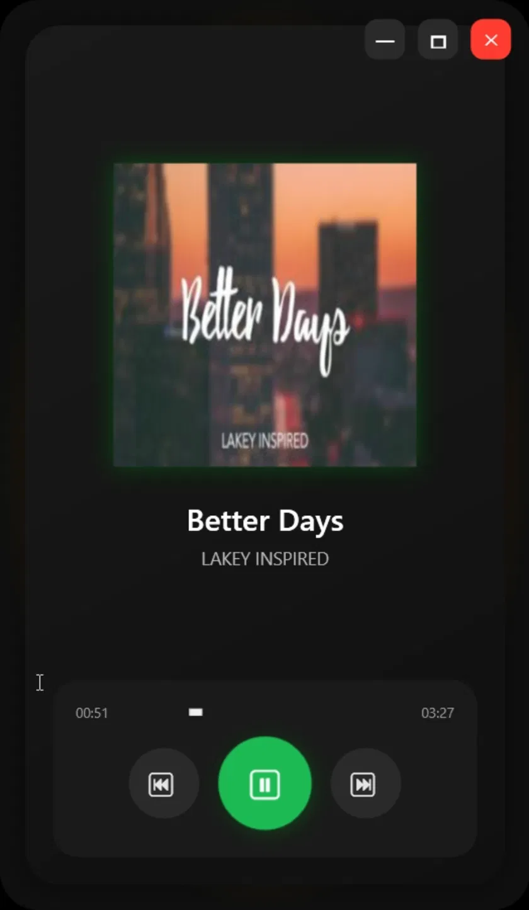
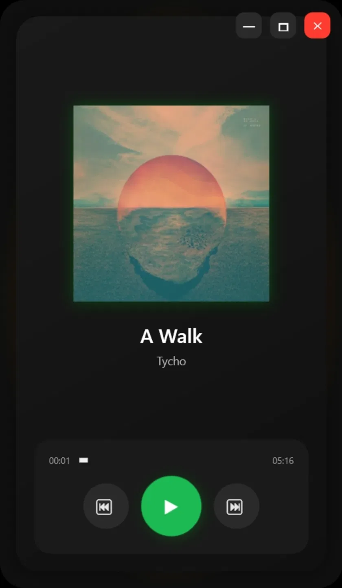

# 🎵 AudioPlayer (Spotify-Inspired UI)

A modern, dark-themed music player desktop app built with **WPF** and **C#**, recreating the look and feel of Spotify's now-playing screen using a clean **MVVM** architecture and fully custom window chrome.

---

## ✨ Features

- 🎨 Dark, Spotify-inspired UI with a glowing album-art accent border
- 🖼 Dynamic album cover, track title, and artist display
- ▶️ Play / Pause toggle with dedicated Next / Previous track controls
- ⏱ Live song progress bar with elapsed and total duration (`00:51 / 03:27`)
- 🪟 Fully custom window chrome — native title bar removed, with hand-built minimize, maximize, and close controls
- 🎯 Clean **MVVM** architecture separating UI from playback logic
- 🎧 FontAwesome icon set for a polished, consistent control layout

---

## 🛠 Tech Stack

| Category | Technology |
|---|---|
| Framework | WPF (.NET) |
| Language | C# |
| UI | XAML |
| Architecture | MVVM (Model-View-ViewModel) |
| Icons | FontAwesome.WPF |

---

## 🏗️ Architecture

```
AudioPlayer/
├── Assets/                     # Album art, icons, static resources
├── Commands/                   # ICommand implementations (RelayCommand, etc.)
├── Models/                     # Track metadata (title, artist, duration, cover art)
├── Services/                   # Playback logic / audio engine wrapper
├── ViewModels/
│   └── MainViewModel.cs        # Playback state, commands, progress binding
├── MainWindow.xaml(.cs)        # Custom chrome + now-playing UI
└── App.xaml(.cs)
```

**Data flow:**

```
MainWindow (XAML)  ↔  MainViewModel  ↔  Services  ↔  Audio engine
```

### Key design decisions

- **Custom window chrome:** WPF's default title bar was removed (`WindowStyle="None"`) in favor of hand-built minimize, maximize, and close buttons. This required manually re-implementing window drag, resize, and state-change behavior that the OS normally handles for free — a common but non-trivial WPF challenge.
- **MVVM over code-behind:** playback state (current track, progress, play/pause status) lives entirely in `MainViewModel`, exposed via data-bound properties and `ICommand` implementations from the `Commands/` folder, keeping `MainWindow.xaml.cs` free of business logic.
- **Progress bar binding:** the slider position and time labels (`00:51`, `03:27`) are bound to a single elapsed-time property on `MainViewModel`, updated on a timer tick — avoiding duplicated state between the visual slider and the underlying playback position.

---

## 📸 Screenshots

| Now Playing | Paused |
|---|---|
|  |  |

---

## 🚀 Getting Started

### Prerequisites

- [Visual Studio 2026](https://visualstudio.microsoft.com/) with the **.NET Desktop Development** workload
- .NET SDK (see `AudioPlayer.csproj` for target version)

### Setup

```bash
git clone https://github.com/AvagyanAlbert/AudioPlayer.git
```

1. Open the solution in Visual Studio
2. Let NuGet packages restore automatically (includes FontAwesome.WPF)
3. Press **F5** to build and run

---

## 📈 Project Status

**✅ Completed** — core playback UI (play/pause, next/previous, progress tracking, custom window controls) is fully functional.

---

## 👨‍💻 Author

**Albert Avagyan** — [GitHub](https://github.com/AvagyanAlbert) · [LinkedIn](https://www.linkedin.com/in/albert-avagyan/)